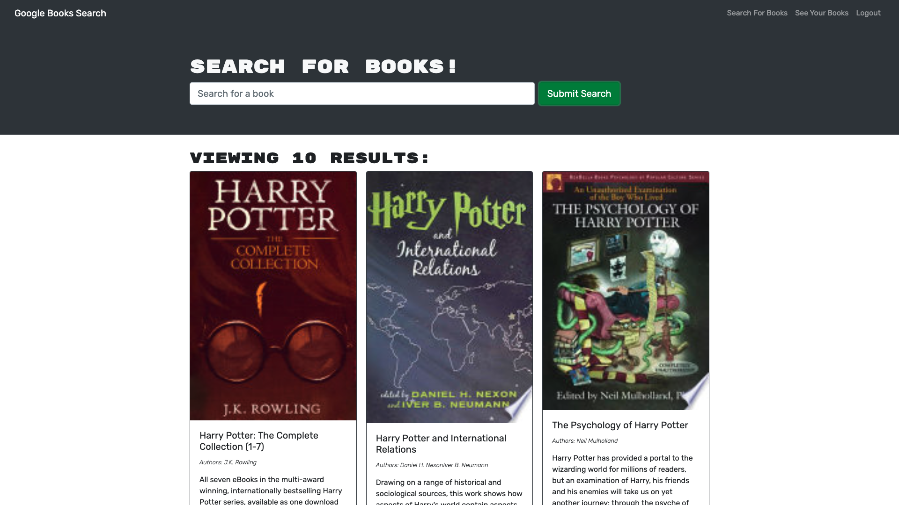

# Book Search Engine

## Description

This weeks challenge was to take a application that used express API routes and refactor it to use an Apollo Server and GraphQL queries and mutations. This application allows a user to search google books via google's API and then view that books information. If the user decides to sign-up then they can save their searched books to their account and view their saved books as well. On the '/saved' page users can see their saved books and choose to remove them if they would like. 

## Table of Contents

* [Installation](#installation)
* [Usage](#usage)
* [License](#license)
* [Contributing](#contributing)
* [Links](#links)
* [Questions](#questions)

## Installation 

Run 'npm install' in the command line to install all the necessary dependencies if trying to run the app locally.

## Usage

To access this application simply navigate to https://desolate-plains-77425.herokuapp.com/ and begin browsing my projects. 

## Licenses

* MIT

## Contributing

* Aaron Centeno

## Technologies Used
* Node Modules
* GitHub
* JavaScript
* React.js
* Terminal
* CSS
* GraphQL
* Apollo Server

## Screenshots

## Links

Live App: https://desolate-plains-77425.herokuapp.com/

GitHub Repo: https://github.com/aaroncenteno/book-search-engine

## Questions

Contact Information for questions: 

GitHub: [aaroncenteno](https://www.github.com/aaroncenteno) 

E-mail: asamcent@gmail.com